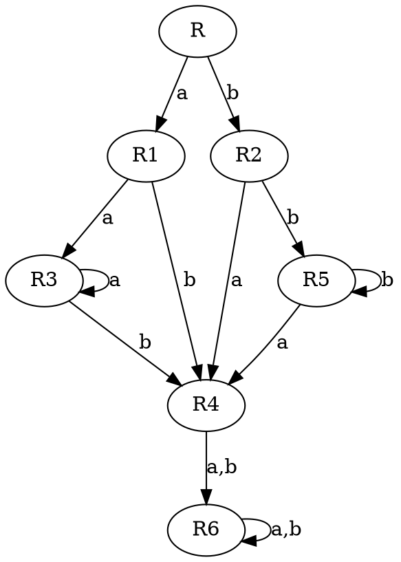
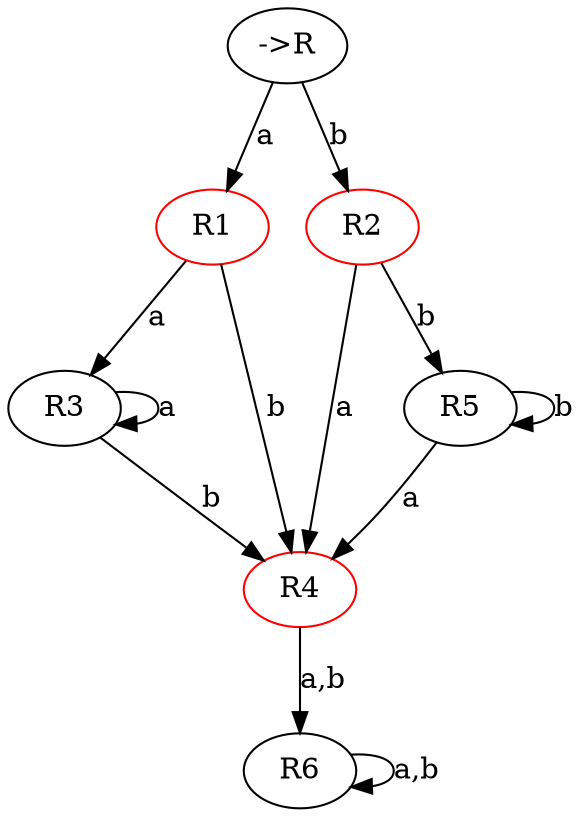
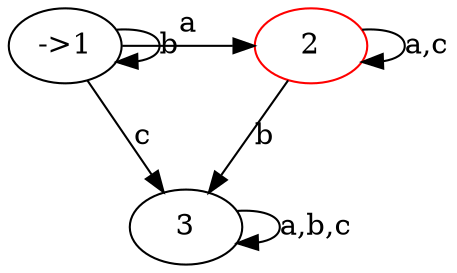
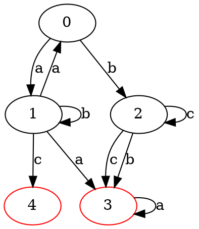
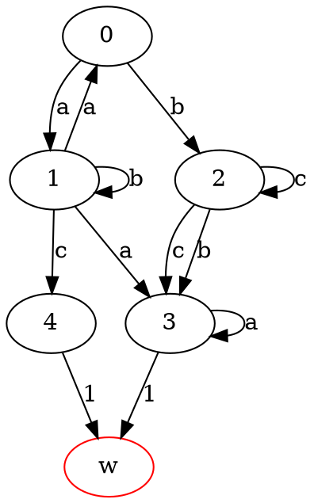
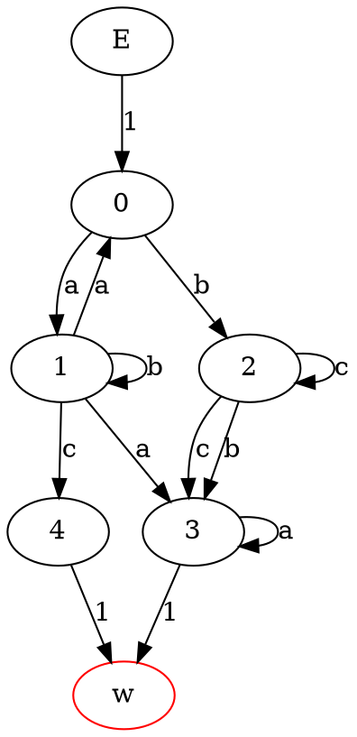
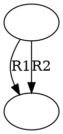
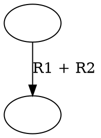

1. Langages rationnels et expressions régulières
2. Automates déterministes
3. Automates non déterministes
4. Grammaires

## I\ Langages rationnels et expressions régulières


valideNumero(numTel,regex)

valide : 07-30-41-24-17
valide pas : 17-24-11

### 2) Quelques règles

#### 1/ Expression régulière en shell

- [lo#] soit l, sois o, sois #
- {7} reppetition (7 fois) ; {3,} min 3 ; {,3} max 3 ; {3,7} entre 3 et 7
- . : jocker n'importe quel char
- | choix (ou)
- \* : répétition de 0 à +infini
- \+ : au moins 1 élément
- ? : zéro ou une fois

#### 2/ Expression régulières de Kleene

* Un alphabet

    $\sum = \{a,b,c\}$
    
* Expressions régulières
    - s avec $s \in \sum$
    - $R_{1} + R_{2}$ avec $R_{1}, R_{2}$ des exp. reg.
    - $R_{1} . R_{2}$ avec $R_{1}, R_{2}$ des exp. reg.
    - $R^{*}$ avec $R$ exp. reg.
    - $\epsilon$ pour le mot vide
    - $\emptyset$ pour le langage vide

* __exemple__ 

  * L'expression reg. qui reconnait le langage avec un nombre paire de a : (a.a)*
  * (a.a)* + (b.b)* pour un nombre paire de a ou de b.
  * $\sum = \{a,b\}$ tous les mots avec 3 a
    
      b*.a.b*.a.b*

  * $\sum = \{a,b\}$ pair de lettre

      ((a + b).(a + b))*

* Langage reconnu
  * $L(\emptyset) = \emptyset$
  * $L(\epsilon) = \{\epsilon\}$
  * $L(S) = \{S\} S \in \sum$
  * $L(R_{1} + R_{2}) = L(R_{1}) \cup L(R_{2})$
  * $L(R_{1} . R_{2}) = \{ u.v\ avec\ u \in L(R_{1})\ et\ v \in L(R_{2})$
  * $L(R^{*}) = \{ u^{n} ou\ n \in \N, et u \in L(R)\}$

## II\ Reconnaitre si un mot appartient au langage

### 1) Reconnaitre si un mot vide appartient au langage

On repaire le connecteur principal :
- si on a un . on regarde qu'il y est le mot vide de chaque coté
- si on a un + on regarde si il y a le mot vide dans un des deux coté
- si on a une * il y a forcement le mot vide
- si on a $\epsilon$ il y a le mot vide
- si on a $\emptyset$ ou un autre caractere il n'y a pas le mot vide

### 2) Dérivation

#### les régles de dérivation 
- $\emptyset/a = \emptyset$
- $b/a = \emptyset$
- $\epsilon/a = \emptyset$
- $a/a = \epsilon$
- $(e_{1} + e_{2})/a = e_{1}/a + e_{2}/a$
- $(e_{1}\ .\ e_{2})/a = e_{1}/a\ .\ e_{2}\ si\ \epsilon\ L(e_{1})$
- $(e_{1}\ .\ e_{2})/a = e_{1}/a\ .\ e_{2} + e_{2}/a$
- $e^{*}/a = e/a\ .\ e^{*}$

### 3) Algorithme de reconnaissance de mot

Pour savoir si un mot est dans le langage de l'exp. reg. , on derive l'ER par chaque lettre du mot.

Une fois terminé on regarde si le mot vide appartient au langage de l'ER dérivée.

```
exp = ER
pour chaque lettre A du mot faire
    exp = deriver(exp,A)
FinPour
retourner ContientMotVide(exp)
```

# Automates finis

## I\ De la dérivation aux automates

### 2) Dérivation sur un exemple

alphabet : $\sum = \{a,b\}$

ER : $R = a^{*}b+b^{*}a$

on dérive avec chaque caractère de l'alphabet :

- $R/a = a^{b}+\epsilon = R_{1}$
- $R/b = \epsilon + b^{*}a = R_{2}$

On dérive jusqu'aux expression que l'on connait déjà :

- $R_{1}/a = a^{*}b = R_{3}$
- .
- .
- .
- $R_{6}/b = \emptyset = R_{6}$

Il existe un nombre fini de dérivé mais ce n'est pas démontré.

### 2) Automates des dérivées
schéma des passages entre les différentes expressions.


- noeud = état
- flèche = transition

schéma avec état initial et états finaux



### 3) Exercice

montrer que $b^{*}a(a+c)^{*}$



## II\ Automates

Def formel des automates

### 1) Définition
- Un alphabet : $\sum$
- Un ensemble fini d'état : $Q$
- Un état initial : $q_{0}\ \epsilon\ Q$
- Un ensemble d'états finaux : $F \subset Q$
- Une fonction de transition : cf TD3

# Des automates aux expressions régulières

## Objectif
On a vu comment passer d'une ER à un automates. On va voir comment passer d'un automate à une ER

## I\ Algorithme

On va modifier notre automate au fur et a mesure, en lui ajoutant puis en supprimant des états.

On va effectuer l'algo sur l'automate ci-dessous.



### 1) initialisation

On commence par ajouter un état : $\omega$ ***, qui devient l'unique état final***.



On ajoute un second état $\alpha$, ***unique état initial***.



### 2) Itération

On va effectuer deux règles (des transitions ou des états)

#### Elimination des transitions



On élimine comme suit :

