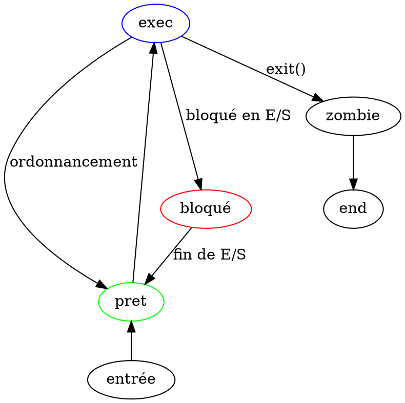

1. Description des processus
2. Etats des processus
3. L'appel système fork()
4. Appel système execv
5. Appel système exit

# I/ Description des processus

## 1.1 

task_struct décrit les données d'un processus pwd etc.

ex : ls est dans /usr/bin/ls

les task state statement contient les valeurs de tous les registres du proc au moment de l'interuption du processus

- 1) Les fichiers ouverts
    - struct file * filp[NR_OPEN];
    ```dot
    digraph G{
        task [label="task"]
        structFile [label="Struct File"]

        task -> structFile
    }
    ```

- 2) Les autres processus
    - long pid,father, pgrp,session,leader

- 3) Les utilisateurs
    - unsigned short uid,euid,suid et unsigned short gid,egid,sgid

- 4) Le systeme de fichier
    - les 4 lignes avant le struct file * filp[NR_OPEN]


# II/ Etats des processus

## 2.1



# III/ L'appel système fork()

## 3.1

```c
#include <stdio.h>
#include <stdlib.h>
#include <unistd.h>
#include <sys/types.h>

int main() 
{
	pid_t pid = fork();
	if (pid == -1) {
		// Il y a une chute historique du PID
		perror("fork");
		return EXIT_FAILURE;
	} else if (pid == 0) {
		// On est dans le fils
		printf("je suis le fils");
	} else {
		// On est dans le père
		printf("Je suis le pere, mon fils à le PID : %d", getpid());
	}
	return EXIT_SUCCESS;
}
```

## 3.1

```c
void forkFils(int n)
{
    int pid;
    for (int i = 0; i < n; i++){
        if (pid = fork () == 0) {
		    // On est dans le fils
		    break;
        }
    }
}

void forkArbreFils(){
    int pid;
    for (int i = 0; i < n; i++){
        if (pid = fork () != 0) {
		    // On est dans le fils
		    break;
        }
    }
}
```

